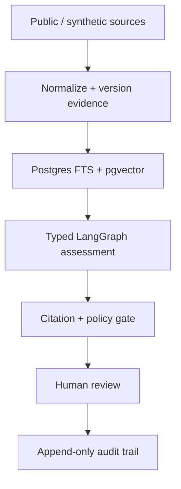
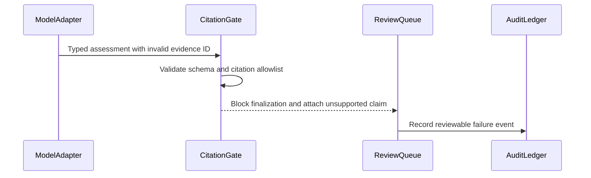
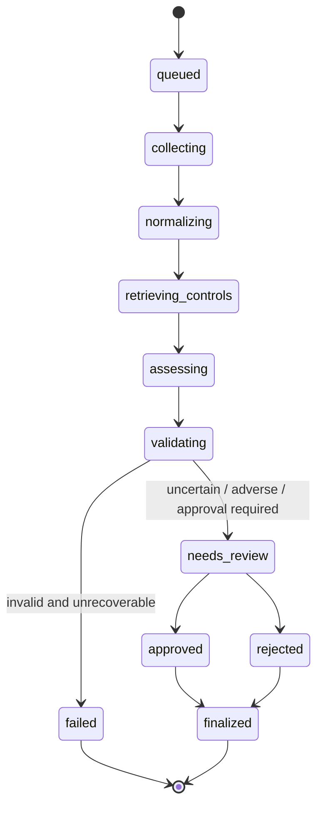

<!-- README: case-study shell. Demo WebPs land only after real recordings exist — see docs/ASSETS.md. -->

<div align="center">
  

# Agentic Evidence Pipeline

### Evidence in. Reviewable decisions out.

A stateful TypeScript reference implementation that turns public or synthetic source material into typed, cited assessments—then pauses for human approval and preserves the complete decision trail.

[30-second](#the-30-second-version) ·
[Status](#what-works-today-vs-planned) ·
[Architecture](#architecture) ·
[When the model is wrong](#what-happens-when-the-model-is-wrong) ·
[Run locally](#run-it-locally) ·
[Lifecycle](#run-lifecycle) ·
[Evidence map](#evidence-map) ·
[Assets](#visual-assets-needed) ·
[Limits](#status-and-limitations)


</div>

## The 30-second version

| | |
| --- | --- |
| **Input** | Versioned public/synthetic evidence (GitHub, HTTP/Markdown, CSV fixtures) |
| **Work** | Hybrid retrieval + typed LangGraph assessment with explicit state |
| **Guarantee** | Unsupported citations fail closed; uncertain results pause for a person |
| **Output** | Approved, edited, or rejected assessment + append-only event trail |
| **Inspectability** | Source revisions, prompt version, citations, retries, latency, cost, failure class |

Not a chatbot. No autonomous third-party writes. Public reference implementation with **public/synthetic fixtures only**.

## What works today vs planned

| Area | Status | Proof |
| --- | --- | --- |
| Monorepo + `bun run verify` + CI | **done** | GitHub Actions `verify` |
| Prisma schema, pgvector column, tenant helpers | **done** | `@aep/db` + migrations |
| Fixture connectors + normalize/hash | **done** | `@aep/contracts` / `@aep/connectors` tests |
| Hybrid retrieval (FTS + vector fusion) | **done** | `@aep/retrieval` + `bun run demo:retrieve` |
| LangGraph + human interrupt/resume | planned | AEP-05 |
| Citation gate in the run path + review UI | partial → planned | helper exists; full gate/UI AEP-06/07 |
| Trigger.dev durability + offline demo CLI | planned | AEP-08 / AEP-11 |
| Recorded README demo loop | planned | after behavior exists — [ASSETS.md](docs/ASSETS.md) |

## Why this exists

Most agent demos stop when the model sounds plausible. The hard questions come after:

- Which source revision supported each sentence?
- What happens when the model invents a citation?
- Can a person stop, edit, or reject the decision?
- Does a worker restart preserve pending review?
- Can an operator explain the run without a debugger?

This repo treats those as the product.

## Demo scenario

A program manager evaluates a partner organization against a published digital-readiness rubric:

1. collect public/synthetic evidence;
2. normalize, version, and hash it;
3. retrieve rubric controls + evidence (lexical + vector);
4. produce a bounded, typed assessment;
5. verify every evidence reference;
6. pause when human judgment is required;
7. record the decision in an append-only audit ledger.

No private institutional, applicant, customer, or contact data.

## Architecture



Collection, hashing, retrieval filters, schema validation, citation checks, state transitions, approval, and audit persistence stay **deterministic**. The model is used only where interpretation is required.

Deeper diagrams: [`docs/ARCHITECTURE.md`](docs/ARCHITECTURE.md).

## What happens when the model is wrong?

Memorable failure: fluent assessment + **nonexistent evidence ID**.



The system does not “repair” unsupported claims with invented prose. It returns `insufficient_evidence` or routes to review.

## Run it locally

**Requirements:** Bun 1.2+, Docker (for Postgres). No model-provider credential for offline unit tests.

```bash
git clone https://github.com/moisestech/agentic-evidence-pipeline.git
cd agentic-evidence-pipeline
bun install --frozen-lockfile
cp .env.example .env
bun run db:up          # Docker Desktop must be running
bun run db:migrate
bun run bootstrap
bun run doctor
bun run verify
```

Without Docker, `bun run verify` still runs format/lint/typecheck/unit tests; DB integration tests skip until `DATABASE_URL` is set.

| Command | Meaning |
| --- | --- |
| `bun run verify` | Format, lint, typecheck, tests (CI gate) |
| `bun run demo:retrieve` | Seed fixtures and print lexical/vector/hybrid hits (needs Docker DB) |
| `bun run demo` | Full offline review flow — **not implemented yet** |
| `bun run eval:offline` | Golden-set harness — **AEP-09** |

## Run lifecycle



## Evidence map

| Capability | Implementation | Verification | Artifact |
| --- | --- | --- | --- |
| Workspace quality gate | root + turbo | `bun run verify` / CI | Actions badge |
| Tenant-scoped DB | `packages/db` | tenant unit + integration tests | migrations |
| Fixture connectors + hash | `packages/connectors` | connector contract tests | `fixtures/` |
| Citation allowlist helper | `packages/contracts` | citation-gate unit tests | failure demo (later) |
| Persisted agent + HITL | `packages/agent` | restart/resume test | run timeline (later) |
| Hybrid retrieval | `packages/retrieval` | RRF unit tests + CI integration | `demo:retrieve` |

Full claim index: [`docs/EVIDENCE_LEDGER.md`](docs/EVIDENCE_LEDGER.md).

## Visual assets needed

README packaging checklist (what exists vs what to capture next):

| Need | File | Status |
| --- | --- | --- |
| Mark / lockup | `docs/assets/aep-mark.svg`, `aep-lockup.svg` | **done** |
| Social preview | `docs/assets/social-preview.png` | **done** |
| Architecture Mermaid | in README / ARCHITECTURE | **done** |
| Demo review loop | `docs/assets/demo-review-flow.webp` | after offline demo |
| Invalid-citation clip | `docs/assets/demo-invalid-citation.webp` | after citation gate + UI |
| Run inspector shot | `docs/assets/run-inspector.png` | after AEP-10 |
| Eval report shot | `docs/assets/eval-offline-report.png` | after AEP-09 |

Details, capture rules, and production order: **[`docs/ASSETS.md`](docs/ASSETS.md)**.

## Design decisions

- One explicit graph, not multi-agent theater.
- Postgres for lexical + vector retrieval (fewer ops surfaces).
- Deterministic fake provider is first-class for CI.
- Human review is persisted state, not a browser modal.
- Every public claim needs linked evidence.

ADRs: [`docs/adr/`](docs/adr/).

## Status and limitations

**Status:** building toward `v0.1.0` (AEP-01–AEP-04 landed).

This is a public reference implementation—not customer production, SOC 2, or a security certification. No email/SMS, no autonomous final decisions, no private data in fixtures.

See [`docs/EVIDENCE_LEDGER.md`](docs/EVIDENCE_LEDGER.md) for prohibited claims.

## Origin

Extracted from patterns behind production generative storytelling, institutional memory/retrieval, governed approval workflows, and model cost/latency instrumentation—without publishing client or institutional data.

[Moises Sanabria](https://moises.tech) — full-stack AI systems builder and artist in Miami.

## License

[MIT](LICENSE)
