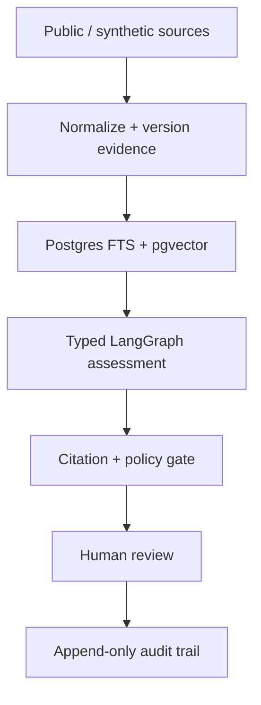
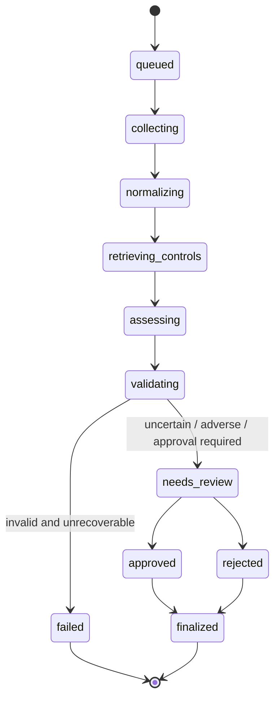

<!-- Shell README: demo recordings and generated metrics are deferred until behavior exists. -->

<div align="center">
  

# Agentic Evidence Pipeline

### Evidence in. Reviewable decisions out.

A stateful TypeScript reference implementation that turns public or synthetic source material into typed, cited assessments—then pauses for human approval and preserves the complete decision trail.

[Run it locally](#run-it-locally) · [See the architecture](#architecture) · [Inspect the evidence](#evidence-map) · [Read the limitations](#status-and-limitations)


</div>

## The 30-second version

| | |
| --- | --- |
| **Input** | Versioned public or synthetic evidence from GitHub, HTTP/Markdown, and CSV sources |
| **Work** | Hybrid retrieval + a typed LangGraph assessment with explicit state |
| **Guarantee** | Unsupported citations fail closed; uncertain or adverse results pause for a person |
| **Output** | An approved, edited, or rejected assessment with an append-only event trail |
| **Inspectability** | Every run exposes source revisions, prompt version, citations, retries, latency, cost, and failure class |

This is not a chatbot and it does not autonomously modify external systems. It is a public reference implementation extracted from patterns encountered building generative-AI and institutional workflow systems. All included data is public or synthetic.

## Why this exists

Most agent demos optimize for the moment a model produces a plausible answer. The difficult part begins after that moment:

- Which source revision supported each sentence?
- What happened when the provider returned malformed output or invented a citation?
- Can a person stop, edit, or reject the decision?
- Does a worker restart preserve pending review state?
- Can an operator explain the run without attaching a debugger?

Agentic Evidence Pipeline treats those questions as the product.

## The demo scenario

A program manager evaluates a partner organization against a published digital-readiness rubric. The system:

1. collects public or synthetic evidence;
2. normalizes, versions, and hashes it;
3. retrieves the relevant rubric controls and evidence with lexical + vector search;
4. produces a bounded, typed assessment;
5. verifies every evidence reference;
6. pauses when human judgment is required; and
7. records the final decision in an append-only audit ledger.

No private institutional, applicant, customer, or contact data is included.

> **Demo recordings:** the 30-second visual loop will be added only after the offline fixture demo and tests exist. Until then, use the architecture and failure walkthrough below.

## Architecture



The model is used only where interpretation is necessary. Source collection, hashing, retrieval filters, schema validation, citation checks, state transitions, approval, and audit persistence remain deterministic.

For container boundaries, the complete state machine, evidence lineage, and failure/replay sequences, see [`docs/ARCHITECTURE.md`](docs/ARCHITECTURE.md).

## What happens when the model is wrong?

The memorable failure fixture returns a fluent assessment with an evidence ID that does not exist.

```mermaid
sequenceDiagram
    participant M as Model adapter
    participant V as Citation gate
    participant R as Review queue
    participant L as Audit ledger
    M->>V: Typed assessment + invalid evidence ID
    V->>V: Validate schema and citation allowlist
    V-->>R: Block finalization; attach unsupported claim
    R->>L: Record reviewable failure event
```

The system does not “repair” an unsupported claim by inventing better prose. It returns `insufficient_evidence`, or routes the result to review according to policy.

## Run it locally

### Requirements

- Bun — version will be pinned in the lockfile when the workspace is wired
- Docker with Compose
- No model-provider credential for the offline demo

```bash
git clone https://github.com/moisestech/agentic-evidence-pipeline.git
cd agentic-evidence-pipeline
bun install --frozen-lockfile
bun run bootstrap
bun run doctor
bun run demo
```

> **Status:** these commands are declared as placeholders in `package.json`. They become executable as AEP-01 through AEP-12 land. Prefer `docs/ARCHITECTURE.md` and the evidence map until `doctor` and `demo` pass on a fresh clone.

The default demo will use the deterministic fake provider. A live-provider evaluation is a separate, explicit command and is never required for tests or CI.

### Verification (planned)

```bash
bun run verify
bun run eval:offline
```

## Run lifecycle



Pending reviews are persisted. Restarting the API or worker must not erase the interrupt or create a second run when the same idempotency key is submitted.

## Grounding and retrieval

The retrieval layer keeps three comparable modes:

- PostgreSQL full-text search baseline;
- pgvector semantic retrieval; and
- deterministic rank fusion across both lists.

Tenant and visibility filters run before prompt construction. The citation gate accepts only evidence IDs retrieved and allowlisted for the current run; nonexistent, hidden, stale, and cross-tenant citations fail closed.

## Human review is a state transition, not a modal

The reviewer can:

- approve the assessment as written;
- edit it while preserving before/after hashes; or
- reject it with a reason.

Every action appends an event with actor type, run ID, trace ID, timestamp, and hash-chain metadata. The UI is an operational run inspector—there are no chat bubbles.

## Evaluation

The committed golden set will cover:

- supported, unsupported, conflicting, and missing evidence;
- malformed output and model refusal;
- prompt injection inside a source document;
- cross-tenant citation attempts;
- stale source revisions;
- timeouts and rate limits.

The runner measures retrieval, citation, schema, abstention, human-review, latency, cost, and retry behavior. Offline reports prove the harness; they are not presented as live-model quality benchmarks.

Metrics appear here only after a committed command produces them.

## Evidence map

| Capability | Implementation | Verification | Artifact |
| --- | --- | --- | --- |
| Persisted agent state | `packages/agent` | restart/resume integration test | run timeline screenshot |
| Hybrid retrieval | `packages/retrieval` | lexical/vector/hybrid golden-set comparison | dated offline report |
| Typed output | `packages/contracts` | malformed output + bounded repair tests | validation event fixture |
| Citation grounding | citation gate | invalid/cross-tenant/hidden citation tests | failure demo |
| Human approval | web review flow + API command | approve/edit/reject E2E tests | before/after audit events |
| Durable execution | `trigger/` jobs | duplicate, timeout, retry, and replay tests | trace walkthrough |
| Cost and latency | `packages/telemetry` | aggregation tests | run inspector screenshot |

The complete claim-to-evidence index lives in [`docs/EVIDENCE_LEDGER.md`](docs/EVIDENCE_LEDGER.md). Rows above are **target** proof links until the corresponding code and tests exist.

## Operational behavior

| Failure | Classification | Behavior |
| --- | --- | --- |
| Provider timeout / 429 | Transient | Capped retry with jitter; preserve run and trace IDs |
| Invalid provider schema | Non-retryable after bounded repair | Create a reviewable error record |
| Unsupported citation | Policy failure | Block finalization and surface the unsupported claim |
| Duplicate trigger | Idempotent duplicate | Reuse the existing run; do not create a second review |
| Worker interruption | Recoverable | Resume from persisted state |
| Cross-tenant evidence | Authorization failure | Fail closed before prompt construction |

See [`docs/FAILURE_MODES.md`](docs/FAILURE_MODES.md), [`docs/SECURITY.md`](docs/SECURITY.md), and [`docs/OPERATIONS.md`](docs/OPERATIONS.md).

## Design decisions

- **One explicit graph, not multi-agent theater.** The state machine is easier to test, resume, and explain.
- **Postgres for both lexical and vector retrieval.** Fewer operational surfaces make local verification credible.
- **A deterministic provider is first-class.** CI and the complete offline demo require no paid API or secret.
- **Human review is persisted.** Approval cannot depend on one browser session staying alive.
- **Every public claim needs evidence.** Architecture intentions are labeled as intentions until code and tests exist.

Architecture decisions are recorded in [`docs/adr/`](docs/adr/).

## Status and limitations

**Current status:** building toward `v0.1.0`.

This repository is a public reference implementation, not a claim of customer production deployment, SOC 2 compliance, or security certification. It will use public/synthetic fixtures, one real provider adapter when configured, and one deterministic fake provider. It does not send email/SMS, mutate third-party systems, or make autonomous final decisions.

Known limitations and prohibited claims are tracked in [`docs/EVIDENCE_LEDGER.md`](docs/EVIDENCE_LEDGER.md).

## Origin

I built this to extract the reusable engineering patterns behind work on production generative storytelling, institutional memory and retrieval, governed approval workflows, and model cost/latency instrumentation—without publishing any client or institutional data.

I am [Moises Sanabria](https://moises.tech), a full-stack AI systems builder and artist in Miami. I am interested in systems that remain legible when models, data, institutions, and people disagree.

## License

[MIT](LICENSE)
