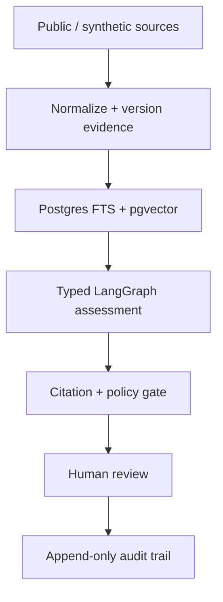
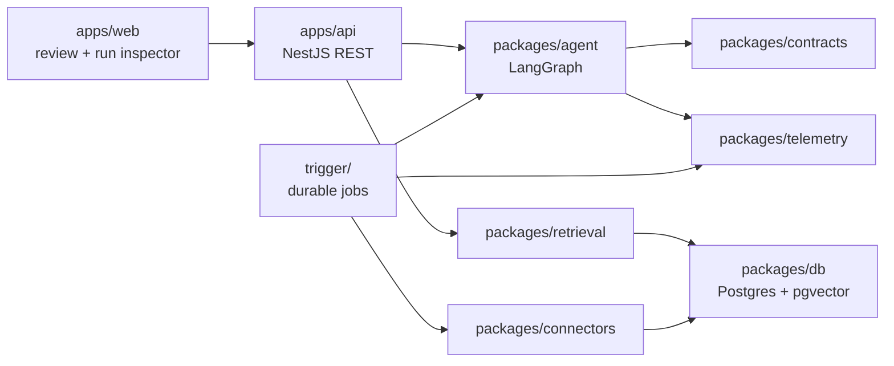
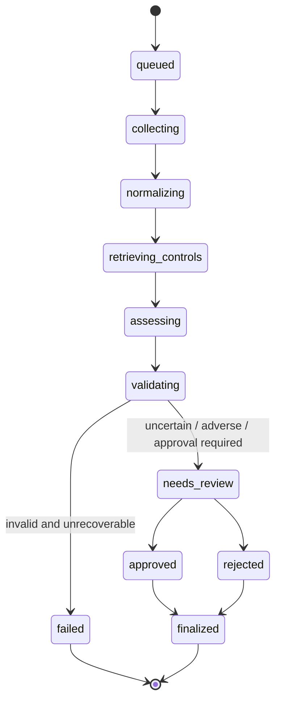
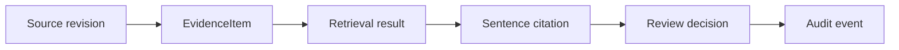
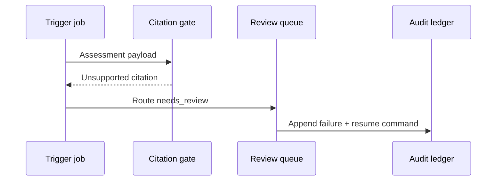

# Architecture

**Status:** target architecture for `v0.1`. Components named below are planned package boundaries; treat unimplemented paths as design, not shipped code.

## Overview

## Container view (planned)

## Run state machine

Explicit states:

1. `queued`
2. `collecting`
3. `normalizing`
4. `retrieving_controls`
5. `assessing`
6. `validating`
7. `needs_review`
8. `approved` | `rejected`
9. `finalized` | `failed`

Invalid transitions fail with a typed domain error. Restarting the API or worker must not lose a pending review.

## Evidence lineage

## Failure and replay (planned)

Memorable fixture: fluent model output with a nonexistent evidence ID. The citation gate blocks finalization and routes to human review.

## Deterministic vs model-driven nodes

| Deterministic | Model-driven |
| --- | --- |
| Fetch fixtures, normalize, hash | Map evidence to rubric control |
| Retrieve with filters | Write bounded assessment summary |
| Validate schema, verify citations | Bounded repair attempt on schema failure |
| Persist audit events | — |
| Approve / edit / reject commands | — |

## Stack targets

- Bun + Turborepo monorepo
- Next.js App Router review UI
- NestJS REST API with committed OpenAPI
- PostgreSQL + pgvector; Prisma migrations; isolated SQL for vector ops if required
- LangGraph JS with persisted interrupt/resume
- Trigger.dev for durable collection/assessment jobs
- Zod contracts shared across boundaries
- OpenTelemetry-compatible traces; privacy-safe structured logs
- Docker Compose for local Postgres/pgvector

## Related docs

- [EVIDENCE_LEDGER.md](./EVIDENCE_LEDGER.md)
- [FAILURE_MODES.md](./FAILURE_MODES.md)
- [OPERATIONS.md](./OPERATIONS.md)
- [SECURITY.md](./SECURITY.md)
- [DEMO_SCRIPT.md](./DEMO_SCRIPT.md)
- [adr/](./adr/)
