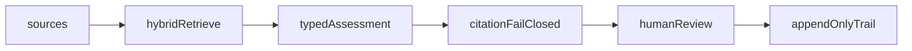

# FDE lane — consulting / governance overlay

This repo is **not** a second agent product. It is the TypeScript inspect surface for consulting and Deloitte-shaped FDE conversations: cited assessments, fail-closed policy, persisted interrupt, durable jobs.

Sister repos: [agentic-ops](https://github.com/moisestech/agentic-ops) (Python runtime + MCP + engagement docs) · [flora-field-kit](https://github.com/moisestech/flora-field-kit) · [comfyui-output-provenance](https://github.com/moisestech/comfyui-output-provenance). Spine: [agentic-ops/docs/FDE-ROADMAP.md](https://github.com/moisestech/agentic-ops/blob/main/docs/FDE-ROADMAP.md).

## What this repo already proves

| FDE skill | Status | Proof |
| --- | --- | --- |
| Hybrid retrieval | **done** | FTS + vector fusion in `@aep/retrieval` |
| Citation fail-closed | **done** | Unsupported ids block and force review |
| HITL persist / resume | **done** | Restart-safe interrupt in `@aep/agent` |
| Durable jobs | **done** | Idempotency, DLQ, replay |
| Offline eval | **done** | `bun run eval:offline` |
| Observability / cost | **pending** | AEP-10 |
| Recruiter-fresh clone | **pending** | AEP-11 |
| Dated release | **pending** | AEP-12 |

## What not to add here

- A second MCP server (lives in agentic-ops)
- Institution-launch program tools (lives in agentic-ops scenarios)
- ServiceNow ownership or a fake ITSM product
- Fine-tuning
- Creative Technique runners (flora-field-kit)

## Next tasks (do these here)

1. **AEP-10** — Aggregate traces, tokens, latency, and cost on the run inspector. Verification: tests that a budget/latency fixture is visible without a debugger.
2. **AEP-11** — `doctor` / bootstrap / one-command demo so a cautious reviewer can clone and see fail-closed + approve. Verification: fresh-clone notes in `docs/`.
3. **AEP-12** — Evidence ledger + `v0.1.0` only after AEP-10/11. No invented customer-production claim.
4. **Honesty pass** — Keep README language: public/synthetic fixtures, not a Deloitte engagement, not SOC 2.

## Recruiter send (consulting lane)

1. This README + run inspector
2. Code inspect: `packages/agent/src/policy.ts`, `packages/retrieval/src/search.ts`, run/resume
3. agentic-ops `docs/engagement/` if they ask how you would install beside a platform you do not own yet
